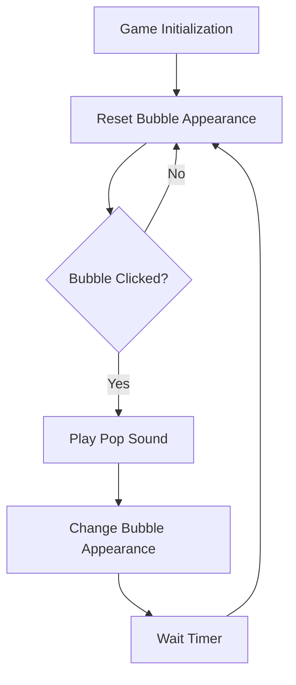

# Bubble Popper 🎯

## Basic Details
### Team Name: Radiants

### Team Members
- Team Lead: Albin Joby - Sahrdaya College of Engineering and Technology
- Member 2: Arun P Manoj - Sahrdaya College of Engineering and Technology
- Member 3: Adithyan Krishna - Sahrdaya College of Engineering and Technology

### Project Description
Bubble Popper is an interactive game where users pop virtual bubbles for fun. It’s a simple, yet oddly satisfying way to pass the time by clicking on bubbles that pop and reappear with a fun "pop" sound effect!

### The Problem (that doesn't exist)
Ever felt the overwhelming frustration of having no bubbles to pop when you're bored? The agony of unpopped bubbles just sitting there, mocking you? Yeah, we thought so.

### The Solution (that nobody asked for)
Introducing Bubble Popper! A web-based game to soothe your pop-cravings. Pop virtual bubbles anytime, anywhere. No soap, no mess, just endless popping satisfaction.

## Technical Details
### Technologies/Components Used
For Software:
- **Languages used:** HTML, CSS, JavaScript
- **Frameworks used:** None (it's lightweight and pure vanilla)
- **Libraries used:** N/A
- **Tools used:** VS Code

### Implementation
For Software:
#### Installation
No installation needed! Simply open the HTML file in a web browser.

#### Run
1. Open `index.html` in any modern web browser.
2. Start popping those bubbles!

### Project Documentation
For Software:

#### Screenshots

#### Diagrams
#### Simple Workflow Diagram

## Project Demo
### Video

https://github.com/user-attachments/assets/15c1bfa9-0dc4-4f96-8f84-f5a9594d8824

### Additional Demos
None

## Team Contributions
- **Albin Joby**: Developed the JavaScript functionality and designed the bubble interaction logic.
- **Arun P Manoj**: Styled the project with CSS, making the bubbles and layout visually appealing.
- **Adithyan Krishna**: Managed sound integration and handled debugging.

---

Made with ❤️ at TinkerHub Useless Projects 

